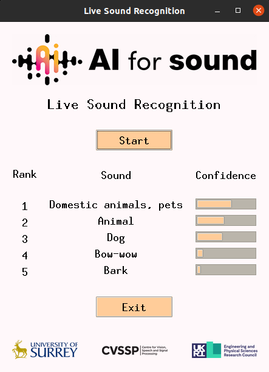

# ai4s_sed_demo

General purpose, real-time sound recognition demo:




The prediction is obtained by applying the audio tagging system on consecutive short audio segments. It is able to perform multiple updates per second on a moderate CPU. A sample video can be viewed at:

https://www.youtube.com/watch?v=7TEtDMzdLeY


**This is a newer version. The original version can be found at [this branch](https://github.com/yinkalario/General-Purpose-Sound-Recognition-Demo/tree/demo2019)**

# Authors

This demo has been developed and trained during our previous AudioSet work, check the following links for more info and models:

* Paper: https://arxiv.org/abs/1912.10211
* Repository: https://github.com/qiuqiangkong/audioset_tagging_cnn

If you use our work, please consider citing us:

[1] Qiuqiang Kong, Yin Cao, Turab Iqbal, Yuxuan Wang, Wenwu Wang, Mark D. Plumbley. "PANNs: Large-Scale Pretrained Audio Neural Networks for Audio Pattern Recognition." arXiv preprint arXiv:1912.10211 (2019).

Yin Cao, Qiuqiang Kong, Andres Fernandez, Christian Kroos, Turab Iqbal, Wenwu Wang, Mark Plumbley


---

# Installation

### Repo:

At the moment, no `pip` installation is available. Clone this repo into `<repo_root>` via:

```
https://github.com/yinkalario/General-Purpose-Sound-Recognition-Demo
```

### Software dependencies:

We recommend using Anaconda to install the dependencies as follows:

```
conda create -n panns python=3.7
conda activate panns
pip install -r requirements.txt
conda install -c anaconda pyaudio
```

A comprehensive list of working dependencies can be found in the [full_dependencies.txt](assets/full_dependencies.txt) file.

### pretrained model (CNN9, ~150MB):

Download the model into your preferred `<model_location>` via:

```
wget https://zenodo.org/record/3576599/files/Cnn9_GMP_64x64_300000_iterations_mAP%3D0.37.pth?download=1
```

Then specify the path when running the app using the `MODEL_PATH` flag (see sample command below).

More models can be found [here](https://zenodo.org/record/3576599) and [here](https://zenodo.org/record/3987831).


# RUN

Assuming our command line is on `<repo_root>`, the `panns` environment is active and the model has been downloaded into `<repo_root>`, the following command should run the GUI with default parameters (tested on Ubuntu20.04):


```
python demo.py MODEL_PATH='Cnn9_GMP_64x64_300000_iterations_mAP=0.37.pth?download=1'
```

Note that the terminal will print all available parameters and their values upon start. The syntax to alter them is the same as with `MODEL_PATH`, e.g. to change the number of classes displayed to 10, add `TOP_K=10`.


---

# Related links:

* https://research.google.com/audioset/dataset
* https://github.com/qiuqiangkong/audioset_tagging_cnn
* https://github.com/qiuqiangkong/panns_inference
* https://github.com/yinkalario/General-Purpose-Sound-Recognition-Demo
* https://github.com/yinkalario/Sound-Event-Detection-AudioSet


